# 大学生兼职管理小程序(文末免费领取☟)
> 
#### 介绍
大学生兼职管理小程序(Java_SpringBoot_微信小程序)
有BUG可留言加微

#### 软件架构
Java + SpringBoot + 微信小程序 + Mybatis + Mysql

#### 项目功能说明

> + 系统分为管理员、企业商家、学生用户角色
> + 登录注册
> + 管理员管理、企业商家管理、学生用户角色管理
> + 兼职管理：兼职管理、兼职留言管理、兼职收藏管理、兼职申请管理
> + 论坛管理
> + 公告管理
> + 基础数据管理：公告类型管理、兼职类型管理、结算类型管理
> + 轮播图管理

### 部分功能演示

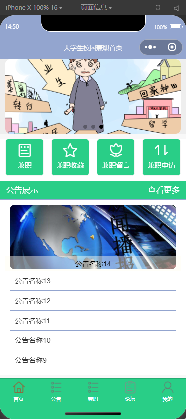
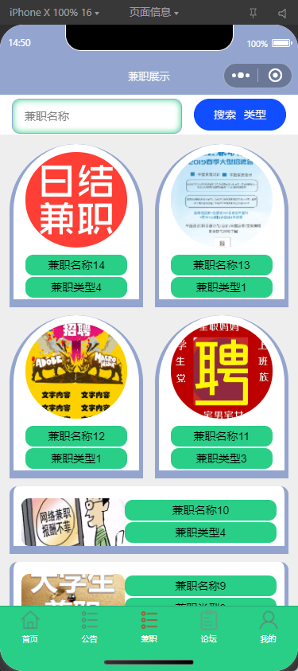
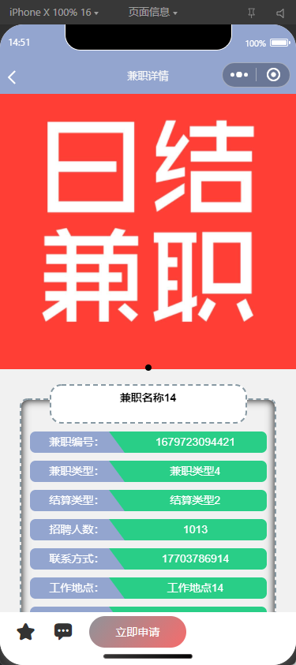
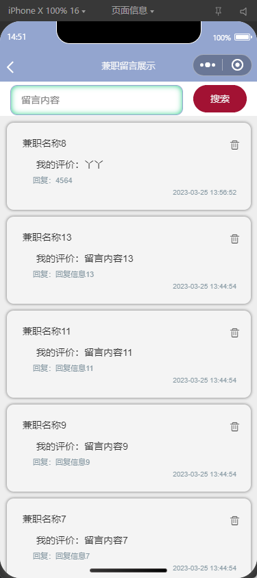

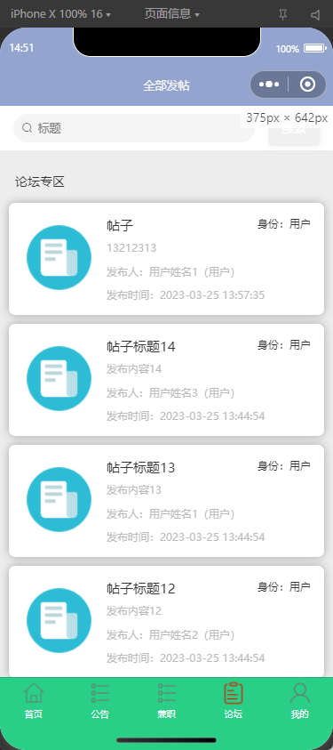
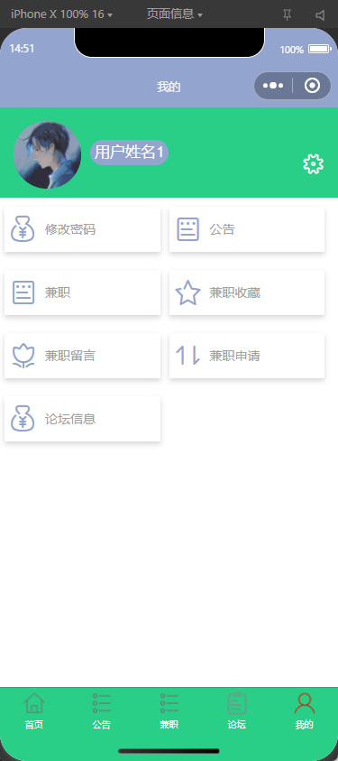

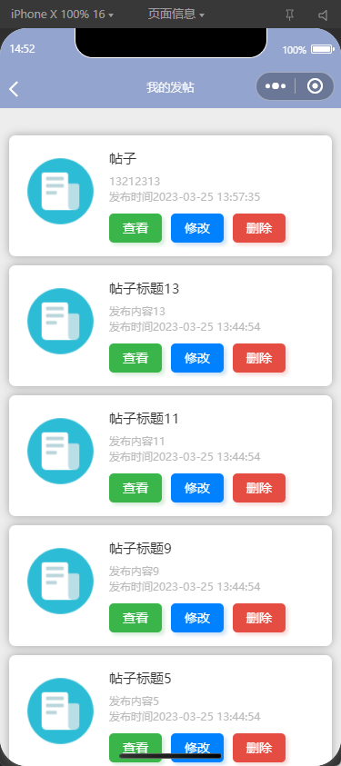

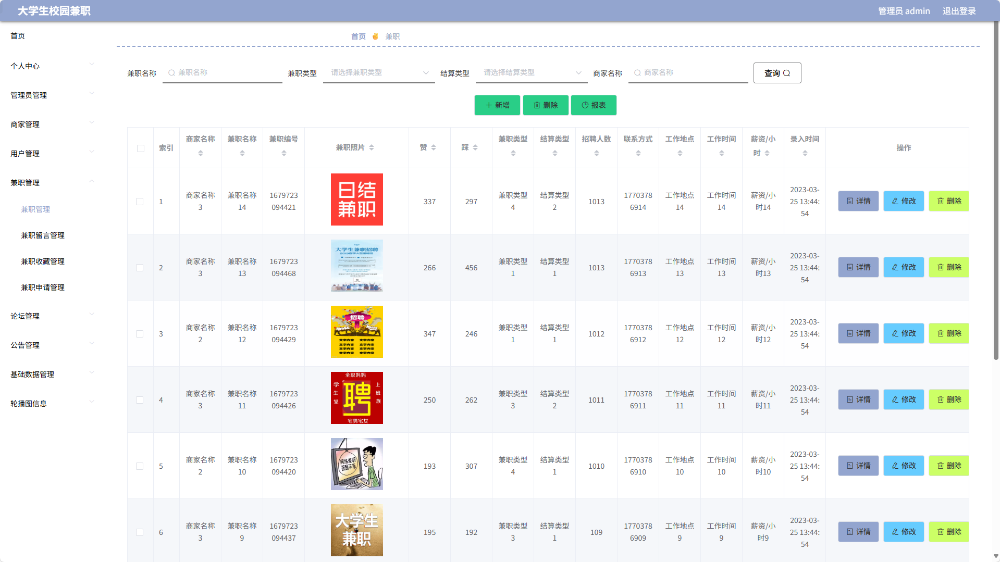
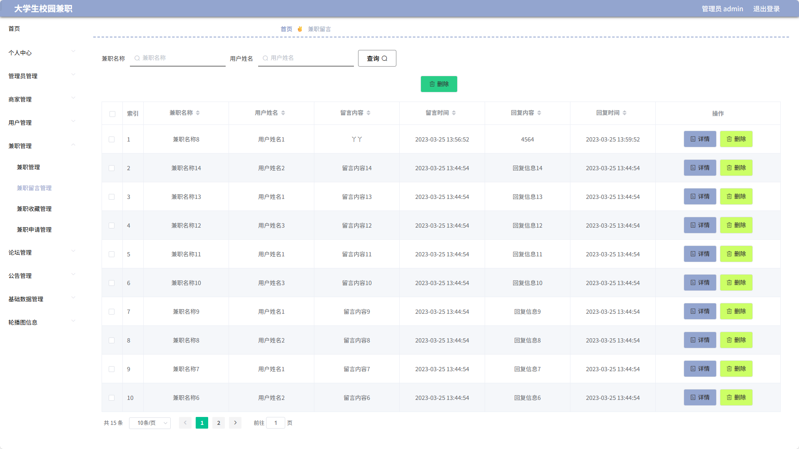
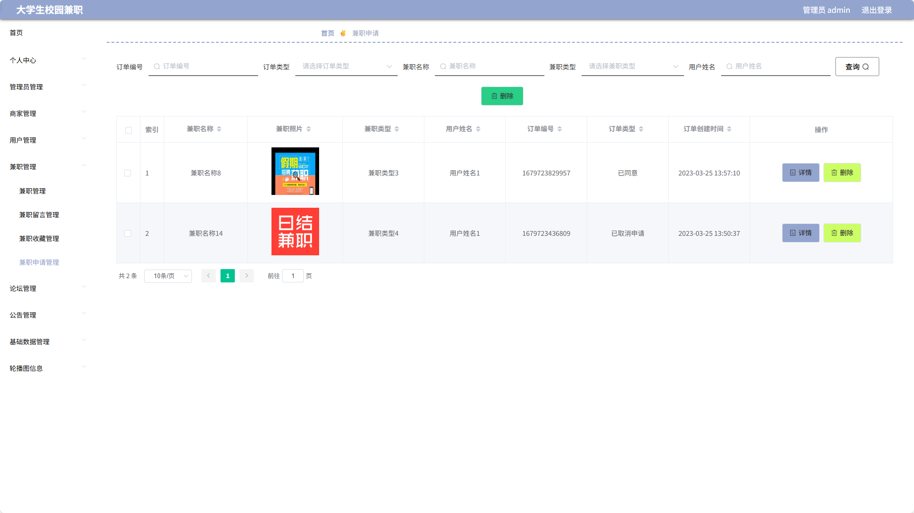
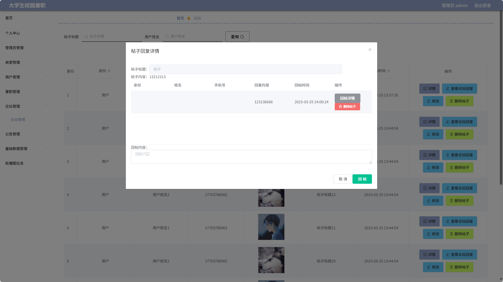

### 环境需求(可免费提供)
- idea/eclipse、jdk-1.8、maven-3.8.6、mysql、node.js等

## 有项目修改、安装调试需求 请联系以下

## 获取资源扫☝☝☝

